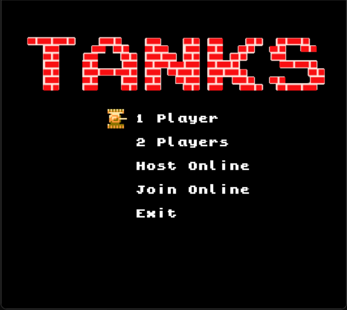
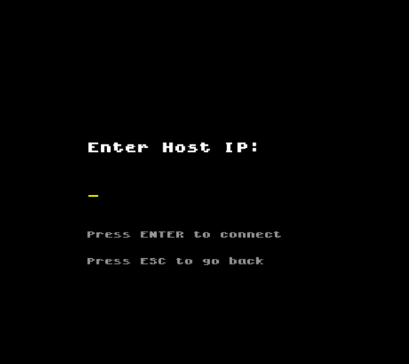

# Tanks

Implementation of Battle City / Tank 1990.
Game was written in C++11 and SDL2 2D graphic library.

Forked from [krystiankaluzny/Tanks](https://github.com/krystiankaluzny/Tanks) with added online multiplayer support.





## Controls:

 - Player 1: arrows and right CTRL to fire
 - Player 2: WSAD and left CTRL to fire
 - Pause: ENTER
 - Jump to next stage: n
 - Jump to previous stage: b
 - Show targets of enemies: t
 - Fullscreen: F11

## Online Multiplayer

This fork adds online multiplayer support using UDP networking via SDL_net.

### How to play online

**Option 1 — Local network**
Both players must be on the same network. The host shares their local IP with the joining player.

**Option 2 — Over the internet (recommended)**
Use [ZeroTier](https://www.zerotier.com) to create a private virtual network between both players:
1. Both players install ZeroTier from https://www.zerotier.com/download
2. Host creates a network at https://my.zerotier.com
3. Both players join the network using the network ID
4. Host authorizes both members on the ZeroTier dashboard
5. Host shares their ZeroTier IP with the joining player

### Hosting a game
1. Launch the game
2. Select **Host Online** from the menu
3. Wait for the joining player to connect
4. Share your IP address with your friend

### Joining a game
1. Launch the game
2. Select **Join Online** from the menu
3. Type the host's IP address
4. Press Enter to connect

### Technical details
- Uses UDP networking via SDL_net
- Lockstep networking — only inputs are sent over the network
- Fixed timestep simulation for deterministic gameplay
- Shared RNG seed ensures enemies behave identically on both machines
- Default port: 12345

## Enemies
Each enemy may fire only one bullet at the same time.
If bullet hits a target, a brick or a stage border and explodes then the enemy may fire next one bullet.
Enemies may have one of four different armour levels. Each level have a different colour.
When a player bullet hits an enemy, it's armor level decrease.
If the armour level falls to zero, then enemy will be destroyed.

If enemy blinks, each hit create new bonus item on a map.

### Enemy types

 -  A type:
    - target: closest player or eagle; 
    - speed: base;
    - behaviour: 80% chance to move towards the target, 20% chance to move in random direction, 
      constantly fires in movement direction
 -  B type: 
    - target: eagle; 
    - speed: 1.3 * base; 
    - behaviour: 50% chance to move towards the target, 50% chance to move in random direction,
      constantly fires in movement direction
 -  C type: 
    - target: eagle; 
    - speed: base;
    - behaviour: 50% chance to move towards the target, 50% chance to move in random direction, 
      constantly fires in movement direction
 -  D type:
    - target: closest player or eagle;
    - speed: base;
    - behaviour: 50% chance to move towards the target, 50% chance to move in random direction,
      fires if target is in front of

## Bonus items

 -  Grenade: all enemies are destroyed
 -  Helmet: active player shield for 10 seconds
 -  Clock: freeze all enemies for 8 seconds
 -  Shovel: create stone wall around eagle for 15 seconds
 -  Tank: increase player lives count 
 -  Star: increase player speed, each next one increases max bullets count
 -  Gun: same as three stars
 -  Boat: allows to move on the water

## Levels

Levels are plain text files located in **levels** directory.
Each level is a two-dimensional array with 26 rows and 26 columns.
Each field in the array should be one of following elements:

 - **.** Empty field
 - **#**  Brick wall: it can be destroyed with two bullets or one if you collect three Stars or Gun
 - **@**  Stone wall: it can be destroyed only if you collect three Stars or Gun bonus
 - **%**  Bush: it can be erased only if you collect three Stars or Gun bonus
 - **~**  Water: it is natural obstacle unless you collect Boat bonus
 - **-**  Ice: tanks are slipping on it

## Build

### Downloads

Pre-built binaries for Windows and Mac are available on the [Actions](https://github.com/cwarkentin/Tanks/actions) page. Download the latest successful build artifact for your platform.

### Linux

#### Requirements

 - make
 - libsdl2-dev
 - libsdl2-ttf-dev
 - libsdl2-image-dev
 - libsdl2-mixer-dev
 - libsdl2-net-dev

On Debian based systems you can run:

`sudo apt install libsdl2-dev libsdl2-ttf-dev libsdl2-image-dev libsdl2-mixer-dev libsdl2-net-dev`

### Mac

#### Requirements

 - make
 - sdl2
 - sdl2_ttf
 - sdl2_image
 - sdl2_mixer
 - sdl2_net

`brew install sdl2 sdl2_ttf sdl2_image sdl2_mixer sdl2_net`

#### Compilation

In the project directory run:

`make clean all`

As a result **build** directory should be created.
In **build/bin** there will be **Tanks** binary file with all necessary resources files.

The Tanks has to be run from bin directory otherwise you got black screen.
Have fun.

`cd build/bin && ./Tanks`

### Windows

#### Requirements

 - [MSYS2](https://www.msys2.org) with the MinGW x64 terminal
 - Run the following in the MSYS2 MinGW x64 terminal:
```bash
pacman -S make mingw-w64-x86_64-gcc mingw-w64-x86_64-SDL2 mingw-w64-x86_64-SDL2_ttf mingw-w64-x86_64-SDL2_image mingw-w64-x86_64-SDL2_mixer
```

SDL_net and other SDL libraries are bundled in the `resources/SDL` directory.

#### Compilation

Open the **MSYS2 MinGW x64** terminal, navigate to the project directory and run:

`make clean all`

As a result **build** directory should be created.
In **build/bin** there will be **Tanks.exe** binary file with all necessary resources files.

`cd build/bin && ./Tanks.exe`